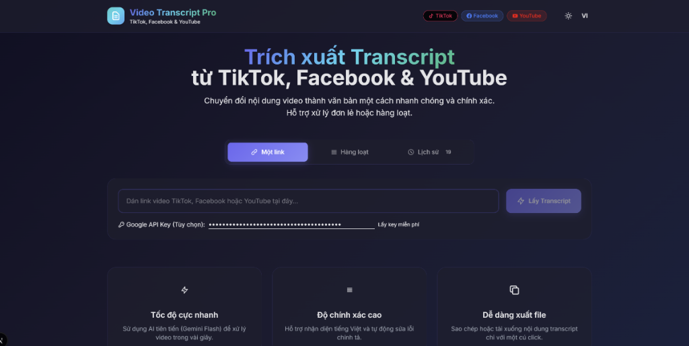

# 🎬 Video Transcript Pro

**🌐 Language / Ngôn ngữ:** [English](README.md) | [Tiếng Việt](README.vi.md)

Ứng dụng web mạnh mẽ để trích xuất transcript (phụ đề) từ video **TikTok**, **Facebook**, và **YouTube** một cách nhanh chóng và chính xác.



## ✨ Tính năng

- 🚀 **Xử lý nhanh** - Sử dụng AI Gemini để transcript trong vài giây
- 🌐 **Đa nền tảng** - Hỗ trợ TikTok, Facebook, YouTube
- 📦 **Xử lý hàng loạt** - Nhập nhiều link cùng lúc
- 🌍 **Đa ngôn ngữ** - Giao diện Tiếng Việt & English
- 🌙 **Dark/Light Mode** - Tùy chỉnh giao diện theo ý thích
- 📋 **Copy & Download** - Xuất transcript dễ dàng
- 📜 **Lịch sử** - Lưu trữ các transcript đã xử lý

## 🛠️ Công nghệ sử dụng

### Frontend
- **Next.js 16** (App Router, Turbopack)
- **React 19**
- **TypeScript**
- **TailwindCSS**
- **Sonner** (Toast notifications)

### Backend
- **Flask** (Python)
- **yt-dlp** (Tải video/phụ đề)
- **Google Gemini AI** (Transcript & Dịch)
- **FFmpeg** (Trích xuất audio)

## 📋 Yêu cầu hệ thống

### Phương án A: Cài đặt truyền thống
- **Node.js** >= 18
- **Python** >= 3.9
- **FFmpeg** (cài đặt và thêm vào PATH)

### Phương án B: Docker
- **Docker** >= 20.0
- **Docker Compose** >= 2.0

## 🚀 Hướng dẫn cài đặt

### 1. Clone repository

```bash
git clone https://github.com/Kim-Thu/Video-Transcript-Pro.git
cd Video-Transcript-Pro
```

### 2. Cài đặt Frontend

```bash
# Cài đặt dependencies
npm install

# Sao chép file cấu hình mẫu
cp .env.example .env.local

# Chạy development server
npm run dev
```

Frontend chạy tại: `http://localhost:3000`

### 3. Cài đặt Backend

```bash
cd backend

# Tạo virtual environment (khuyến nghị)
python -m venv .venv

# Kích hoạt virtual environment
# Windows:
.venv\Scripts\activate
# macOS/Linux:
source .venv/bin/activate

# Cài đặt dependencies
pip install -r requirements.txt

# Sao chép file cấu hình mẫu
cp .env.example .env

# (Tùy chọn) Thêm Gemini API Key vào .env
# Hoặc nhập trực tiếp trong giao diện app

# Chạy server
python app.py
```

Backend chạy tại: `http://localhost:5000`

### 4. 🐳 Triển khai với Docker (Phương án thay thế)

Chạy cả frontend và backend với một lệnh duy nhất:

```bash
# Build và khởi động tất cả services
docker-compose up -d

# Build lại với images mới
docker-compose up -d --build

# Xem logs
docker-compose logs -f

# Dừng tất cả services
docker-compose down
```

**Services sẽ chạy tại:**
- Frontend: `http://localhost:3000`
- Backend: `http://localhost:5000`

**Cấu hình Gemini API Key cho Docker:**
```bash
# Cách 1: Đặt biến môi trường trước khi chạy
GEMINI_API_KEY=your_key_here docker-compose up -d

# Cách 2: Tạo file .env ở thư mục gốc
echo "GEMINI_API_KEY=your_key_here" > .env
docker-compose up -d
```

## ⚙️ Cấu hình

### Frontend (`.env.local`)

```env
NEXT_PUBLIC_API_URL=http://localhost:5000/api
```

### Backend (`backend/.env`)

```env
PORT=5000
DEBUG=True
GEMINI_API_KEY=your_gemini_api_key_here  # Tùy chọn
```

## 🔑 Lấy Gemini API Key (Miễn phí)

1. Truy cập: https://aistudio.google.com/
2. Đăng nhập với tài khoản Google
3. Tạo API Key mới
4. Sao chép key và dán vào file `.env` hoặc nhập trực tiếp trong giao diện app

## 📖 Hướng dẫn sử dụng

### Xử lý đơn lẻ
1. Dán link video TikTok/Facebook/YouTube vào ô nhập
2. (Tùy chọn) Nhập Gemini API Key nếu chưa cấu hình
3. Nhấn **"Lấy Transcript"**
4. Đợi xử lý và xem kết quả
5. Sao chép hoặc Tải xuống transcript

### Xử lý hàng loạt
1. Chuyển sang tab **"Hàng loạt"**
2. Dán nhiều link (mỗi dòng một link)
3. Nhấn **"Xử lý hàng loạt"**
4. Theo dõi tiến trình và xem kết quả

## 🏗️ Cấu trúc dự án

```
Video-Transcript-Pro/
├── src/                    # Mã nguồn Frontend
│   ├── app/               # Next.js App Router
│   ├── components/        # React components
│   ├── contexts/          # React contexts (Theme, Language)
│   ├── features/          # Components theo tính năng
│   ├── hooks/             # Custom React hooks
│   ├── lib/               # Utility functions
│   ├── locales/           # Bản dịch i18n
│   └── types/             # TypeScript types
├── backend/               # Mã nguồn Backend
│   ├── core/              # Logic workflow chính
│   ├── models/            # Data models
│   ├── routes/            # API routes
│   ├── services/          # Services xử lý nghiệp vụ
│   ├── utils/             # Utility functions
│   └── Dockerfile         # Backend Docker image
├── public/                # Static assets
├── Dockerfile             # Frontend Docker image
├── docker-compose.yml     # Docker orchestration
└── README.md              # File này
```

## 🤝 Đóng góp

Chào mừng mọi đóng góp! Hãy tạo Pull Request hoặc Issues để báo lỗi và đề xuất tính năng.

## 📄 Giấy phép

MIT License - Xem file [LICENSE](LICENSE) để biết chi tiết.

## 👨‍💻 Tác giả

**Kim Thu** - [@Kim-Thu](https://github.com/Kim-Thu)

---

⭐ Nếu bạn thấy dự án hữu ích, hãy cho một star nhé!
